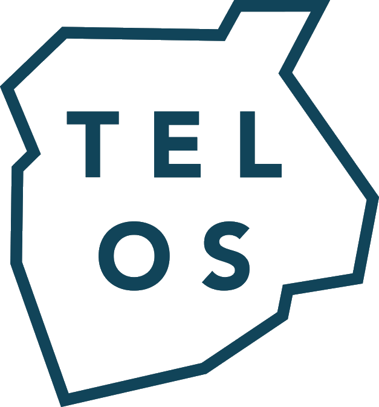
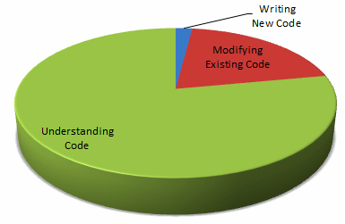

  

The TELOS DreamStack Project provides set of principles, guidelines, tools, packages and starters to jumpstart and speed up dApp development following best practices for security, performance and maintainability of your application.

Application performance is a critical factor in the success of a project, and a major indicator of software quality. It is even one of the essential criteria that determine user satisfaction.

Software maintainability is defined as the degree to which an application is understood, repaired, or enhanced; Developers spent most of their time understing other people's code, and that  is not a trivial endeavor; therefore, it is important to adhere to clear conventions so that the next developer has as little overhead as possible when reading your code.

  
  <small>source: blog.codinghorror.com/when-understanding-means-rewriting</small>

TELOS Dreamstack follows Blockmatic's code style convention that aims to maximize reusability and facilitate collaboration. We have chosen the stack carefully so that it allows us to write robust and performant ReactJS and React Native applications with more concise and readable code.

## Project Goals

- Reduce the time required to launch a TELOS dApp client.
- Provide best in class TELOS dapp starters with adherence clear design principles.
- Simplified onboarding of developers and project hand off.
- Comprehensive documentation and visuals ( Diagrams ).
- Better developer experience.
- Facilitate consistency and maintainility.
- Out-of-the box automation of processes. (Code Quality and Deployment).

## Background

story.

## TELOS WPS

## TELOS DreamStack
