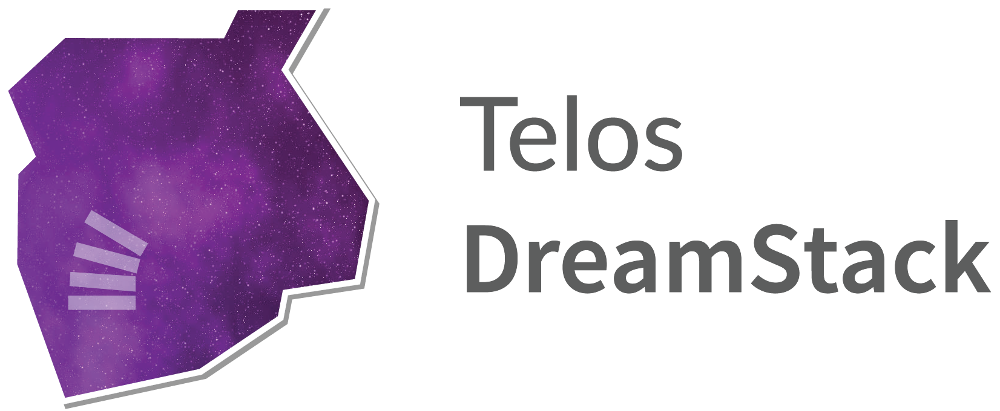
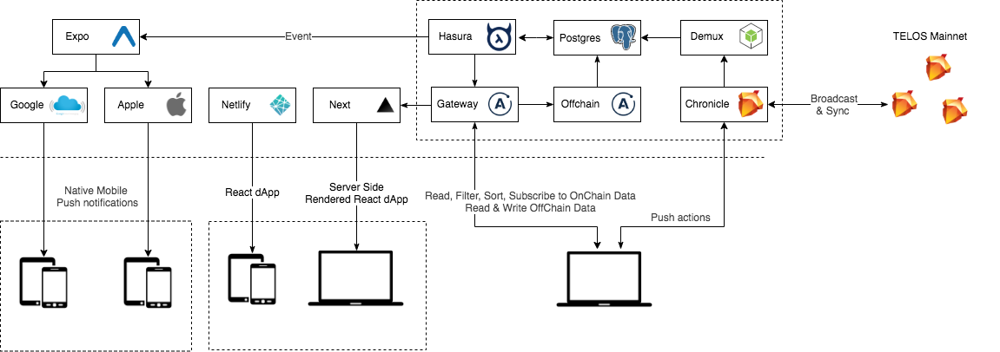

  

The TELOS DreamStack Project provides set of principles, guidelines, tools, packages and starters to jumpstart and speed up dApp development following best practices for security, performance and maintainability of your application.

Application performance is a critical factor in the success of a project, and a major indicator of software quality. It is even one of the essential criteria that determine user satisfaction.

Software maintainability is defined as the degree to which an application is understood, repaired, or enhanced; Developers spent most of their time understing other people's code, and that  is not a trivial endeavor; therefore, it is important to adhere to clear conventions so that the next developer has as little overhead as possible when reading your code.

  
  <small>source: blog.codinghorror.com/when-understanding-means-rewriting</small>

TELOS Dreamstack follows Blockmatic's code style convention that aims to maximize reusability and facilitate collaboration. We have chosen the stack carefully so that it allows us to write robust and performant ReactJS and React Native applications with more concise and readable code.

## Value Proposition

...

## Project Goals

- Reduce the time required to launch a TELOS dApp client.
- Provide best in class TELOS dapp starters with adherence clear design principles.
- Simplified onboarding of developers and project hand off.
- Comprehensive documentation and visuals ( Diagrams ).
- Better developer experience.
- Facilitate consistency and maintainility.
- Out-of-the box automation of processes. (Code Quality and Deployment).

## Background

story.

## TELOS WPS

## TELOS DreamStack

All components of the TELOS dreamstack project are the result of years of experience and extensive research on modern development technologies and patterns.

## Caraterististics

- Principled GraphQL
- Conventional Commits
- 3 Factor dApp
- First things First
  - Built First ( DevOps )
  - Readme First ( Docs First )
  - Mobile First
- SOLID

https://principledgraphql.com/integrity#1-one-graph

## Techonologies

### GraphQL

### Postgres

### Hasura

### Apollo Federation

### React and React Native

React have become the defacto standard although others like vue and angular offer similar functionalities ReactJS functional approach, composability and performace are still unmatched.
...

### System UI

System UI is an open source organization that houses a [Theme Specification](https://system-ui.com/theme) for creating interoperable UI components. It is also the home for the Theme UI and DesignQL libraries that are built upon the foundation of this specification. The intent behind this specification is to help make UI components, libraries, and tools as interoperable as possible.

The theme object is intended to be a general purpose format for storing design system style values, scales, and/or design tokens. The object itself is not coupled to any particular library's implementation and can be used in places where sharing common style values in multiple parts of a code base is desirable.

https://system-ui.com

-

## Dream Team

- Gabo
- Kevin R.
- Kevin W.
- Tatiana.
- Lau.
- Guayo.
